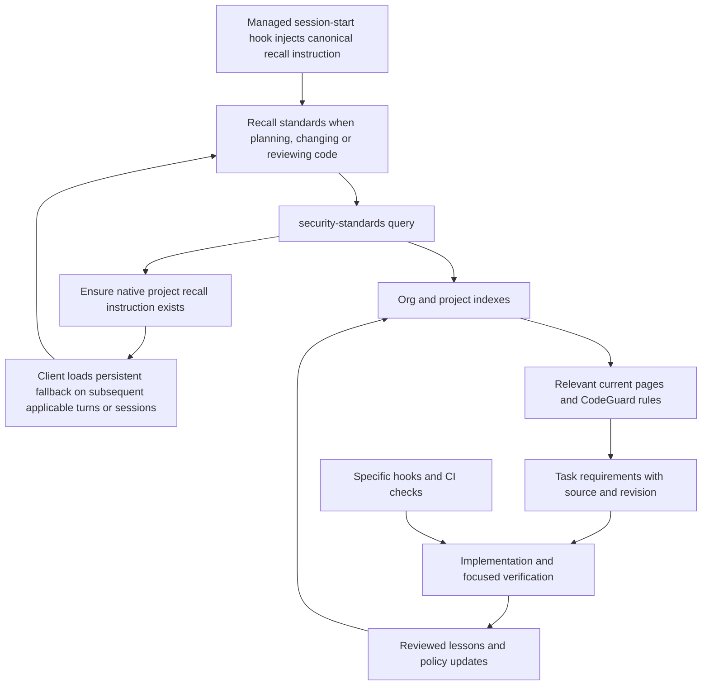

# Security standards: objective architecture and retrieval review

Date: 2026-09-18 · Repository HEAD: `3682e0b17bc015af23a619a7795cae898b62aae4`

**Verdict: a sound, compact knowledge-store design with an incomplete recall mechanism.** The skill supports economical retrieval when an agent invokes it, especially through `security-planner`. It does not establish reliable standards recall during ordinary implementation, resumed work, or changes that bypass the planner. Keep the skill and Markdown corpus; deliver a short recall instruction through a shared session-start hook, with the skill checking for and adding a missing native project instruction as the fallback. Tighten the query contract and measure actual delivery, retrieval and adherence.

**Selected deployment pattern:** the organization already plans managed hook rollout across projects. Use that infrastructure as the primary delivery path, including managed Codex hook trust. Maintain one canonical recall instruction, thin client adapters, and one idempotent rule-presence check when the skill runs. No manual per-project init is required to receive the hook's instruction. This is the recommended fit for that deployment requirement, not a claim of experimentally proven recall reliability.

This is a review and recommendation package. No production skills, rules, hooks, or configuration were changed by this review.

## Assessment against the problem statement

| Goal | Assessment | Evidence / limitation |
|---|---|---|
| Persist organizational knowledge outside the conversation | Achieved structurally | Versioned Markdown, an index, provenance fields, ownership and an ingest workflow |
| Retrieve relevant standards just before using them | Partially achieved | Explicit planner transitions request retrieval; ordinary coding depends on discretionary skill selection |
| Avoid loading the entire wiki | Good starting design | Eleven short topic pages; index-first query; references instead of copied CodeGuard bodies |
| Reliably discover the corpus in a new project/session | Incomplete | Installation exposes skills; init seeds documents. Neither installs a standards recall instruction |
| Apply central mandatory standards plus local exceptions | Described, not demonstrated | Precedence is prose; query does not explicitly resolve both indexes, match overrides, or return conflict evidence |
| Keep retrieval metadata trustworthy | Incomplete | Reproduced false-negative lint results for metadata defects that can break routing |
| Demonstrate effectiveness across clients | Not established | Two corpus unit tests and seed lint; no standards activation/retrieval/adherence evaluation found |
| Avoid implementation bloat | Mostly achieved | One 140-line helper. Simplify instructions and parsing; a new memory platform is unnecessary |

“Available,” “retrieved,” “applied,” and “verified” are different outcomes. A skill listing proves availability. A file-read trace proves retrieval. Neither proves the generated code satisfies a requirement.

## Scope, method, and limits

Reviewed the entire `security-standards` skill, all seed pages, its linter, the planner and CodeGuard locator, guidance/setup integration, remediation integration, skill installer, hook registration, architecture documentation, and corpus tests/CI. Compared these with current primary sources from Anthropic, CodeGuard, Agent Skills, OpenAI, Cursor, GitHub, and Karpathy's original LLM Wiki proposal.

Executed the two existing corpus tests and seed lint; added isolated, reproducible audit probes for metadata validation, literal tag routing, and incomplete CodeGuard discovery. The probes create disposable fixtures and do not modify the implementation. Evidence is in [the audit evidence directory](security-standards-review-2026-09-18/probe-results.json); run instructions are in [probe.py](security-standards-review-2026-09-18/probe.py).

Upstream source was downloaded at these immutable revisions, with hashes recorded in [source-snapshot.json](security-standards-review-2026-09-18/source-snapshot.json):

- Anthropic `claude-plugins-official`: `1aa8f02ec8327f513686934f458a620f83db91ed` (2026-09-17).
- CoSAI `project-codeguard`: `ab81a61472c6690a60300aa9edb39e32de8bef53` (2026-09-16). Separately checked the configured `v1.4.0` rule listing: 23 rules, all 23 referenced rule names in the local pointer page exist.

No live multi-client coding experiments were run. Activation failures below are architectural risks, not measured miss rates. Literal tag probes demonstrate ambiguity in the written algorithm, not a deterministic retriever that this repository implements. No claim is made that missing recall necessarily produces insecure code.

## What is already right

The core storage pattern is appropriate. The [skill](../../plugins/secure-sdlc/skills/security-standards/SKILL.md), [index](../../plugins/secure-sdlc/skills/security-standards/seed/index.md), and [conventions](../../plugins/secure-sdlc/skills/security-standards/seed/conventions.md) separate operating instructions, navigation, and policy content. Short, topical pages make selective reads practical. Committing policy while ignoring caches/results is sensible.

The [planner](../../plugins/secure-sdlc/skills/security-planner/SKILL.md) explicitly consults standards at spec/plan time and turns them into component-specific requirements. Its instruction to state the requirement and cite the source is stronger than merely linking a wiki. [Remediation](../../plugins/secure-sdlc/skills/fix-findings/SKILL.md) feeds recurring issues back into the corpus, while ownership and human review prevent lessons from automatically becoming approved policy.

CodeGuard pointers avoid a second maintained copy of upstream rules. The seed's AI controls complement the conventional security rules. The linter catches real problems, including missing fields, orphan/dead paths, invalid dates, and expired exceptions. Its existing tests pass. These are useful foundations to preserve.

## Findings, ordered by importance

Priority describes impact on the stated product goal, not vulnerability exploitability. P1 should be resolved before claiming dependable JIT standards coverage; P2 should follow before broad organizational rollout.

### F1 — P1: the recall trigger is missing from ordinary coding sessions

**Evidence:** `security-standards/SKILL.md:3` emphasizes knowledge queries, corpus maintenance, and requests from other security skills. The actual index-first instruction is inside the unloaded skill (`:36`). `security-planner/SKILL.md:46` and `:69` provide explicit callers. `scripts/install_skills.sh` copies skill directories; `security-standards` init only describes seeding the corpus. The [plugin hook registration](../../plugins/secure-sdlc/hooks/hooks.json) concerns MCP installation/configuration, not standards recall.

A request such as “add CSV export to the customer endpoint” can proceed through normal coding without selecting either security skill. Nothing provided by this package tells that session, through a project instruction, to read the corpus before implementing. Installation/discovery is therefore not the same as integration into the build workflow. The architecture's description of CodeGuard as an “always-on SKILL.md” also overstates the default loading model.

**Recommendation:** inject a short recall instruction through the managed session-start hook, and put ordinary implementation/review triggers first in the skill description. Whenever the skill runs, check for the native project recall instruction and add it if missing. Keep retrieval independent of the planner: applying standards to a small patch should not require a profile plus intent/spec/plan approval workflow. Test new sessions, scope changes, and resumption after context compaction. The skill fallback cannot repair a session in which neither the hook nor the skill runs.

### F2 — P1: the index can silently diverge from the pages it routes

**Evidence:** [lint_corpus.py](../../plugins/secure-sdlc/skills/security-standards/scripts/lint_corpus.py), lines 55–59, extracts only paths into a set. Lines 77–82 compare path sets; neither index tags nor summaries are checked against page metadata. Duplicate rows disappear into the set.

**Reproduced:** changing the prompt-injection index tags to `infra` while leaving the page's tags unchanged produces zero lint errors. Duplicating its index row also produces zero errors. The index-first agent may never open a relevant page with incorrect index tags. This is directly on the retrieval path, rather than cosmetic schema hygiene.

**Recommendation:** treat page metadata as authoritative and either generate the routing fields in the index or validate equality in CI. Preserve human-written summaries if useful. Detect duplicate paths and malformed rows. One index writer/checker is sufficient; avoid maintaining independent routing registries.

### F3 — P1: CodeGuard discovery can report incomplete coverage as success

**Evidence:** [find-codeguard.sh](../../plugins/secure-sdlc/skills/security-planner/scripts/find-codeguard.sh), lines 18–34, accepts a directory when any matching rule file exists. Installed rules precede the pinned fallback without reporting their actual version. Downloads write directly into the final cache; a later call can accept files left by a failed partial download.

**Reproduced:** a temporary project containing only `codeguard-0-authentication-mfa.md` is accepted with exit 0. All three supposedly always-applied tier-1 rules are absent. This confirms inadequate completeness checking; it does not show that a consuming agent would necessarily overlook the missing files.

**Recommendation:** validate a versioned rule manifest, download to a staging directory, then publish the completed cache atomically. Report the resolved source, actual revision, and available/missing rules. At minimum, require the three baseline rules plus every requested rule before claiming coverage. Do not label an arbitrary installed directory with the fallback's pinned version. Keep network population separate from ordinary reads where practical.

### F4 — P2: the query contract leaves important selection behavior implicit

**Evidence:** `security-standards/SKILL.md:36–42` defines query as index → tag intersection → pages. It does not define scope-to-tag mapping, baseline inclusion, status handling, dependency expansion, or recovery when no row matches.

Specific ambiguities:

- `all-code` appears only on the CodeGuard pointer page, but no instruction gives it wildcard semantics. Literal intersection for scope `{api}` selects only denial-of-wallet; it omits CodeGuard. The planner separately retrieves CodeGuard, reducing this risk in planner-driven use.
- A multi-component agent/RAG scope matches all ten AI topic pages. The “typically 2–6 pages” statement is a heuristic, not a demonstrated bound. Applicable controls must not be dropped to meet that number.
- `seed`, `active`, and `deprecated` exist in the schema, but query does not say whether deprecated pages are historical-only or whether unadopted seeds must be labeled advisory.
- `Related` does not distinguish required dependencies from optional background. Following every related page can load the entire graph; following none can miss a necessary dependency.
- Read-only query has no explicit unavailable-corpus behavior, even though the planner offers initialization. A missing central checkout should not silently become “no standards apply.”

**Recommendation:** add a short ordered query procedure: resolve sources → map scope using summaries/tags → include relevant baseline rules → select current pages → reconcile overlays → return requirements with provenance and gaps. Specify `all-code` explicitly. Use bounded index search/`rg` when semantic matching is uncertain. Re-query when the task gains a new data flow, component, dependency, or trust boundary. Make page counts a budget signal, never a correctness ceiling.

### F5 — P2: central/local precedence is underspecified at the point of retrieval

**Evidence:** `security-standards/SKILL.md:19–26` describes an org directory and repo overlay; `seed/conventions.md:41–48` defines precedence. The query steps say only “read index.md.” They do not explicitly read both indexes, identify corresponding pages, or attach source/revision to the result. Suggested citations such as `knowledge/security/<page>.md` are ambiguous across two stores and omit `.ai-security` for the default store.

The linter accepts one store. It validates exception shape/expiry, but cannot establish whether an exception was approved by its named owner, whether it applies to the weakened requirement, or whether one policy semantically weakens another. `owner:` is a statement in a file, not authorization evidence. Also, `AISEC_KNOWLEDGE_DIR` is external process configuration, so a future session or teammate may not inherit it.

**Recommendation:** resolve and report both stores explicitly; use relative page path as the initial identity convention, with stable requirement IDs for exceptions. Include source label, exact path, revision and exception approval reference in results. Preserve mandatory org requirements and flag uncertain conflicts for policy-owner review. Establish approval through reviewed policy changes/access controls, not a prose comparison that claims deterministic enforcement. During setup record the shared-source location/version in the project's recall instructions without committing machine-specific absolute paths. Specify what happens when that source is unavailable.

### F6 — P2: a hand-written YAML subset creates both false passes and false failures

**Evidence:** `lint_corpus.py:21–44` parses frontmatter with regular expressions and `:100` splits list strings on commas. The documentation presents the format as YAML without restricting that syntax.

| Isolated mutation | Observed result |
|---|---|
| `applies-to: []` | Passes |
| `sources: []` | Passes |
| Active page with `owner: ""` | Passes |
| `domain: development` in a `security/` page | Passes |
| Remove `## Requirements` heading | Passes |
| Valid quoted YAML tags | Rejected as unknown vocabulary |
| Valid `status: "seed"` | Rejected as invalid status |

The conventions' closing assertion that lint checks “all of the above” is too broad. It does not check body structure, testability, related links, precedence, approval, or prohibited vendoring. The pointer page also lacks a Requirements section, so a future body validator needs an explicit pointer-page convention.

**Recommendation:** use a maintained safe YAML parser with explicit types, nonempty values, and duplicate-key handling, or deliberately document and strictly validate a smaller format. A safe parser is the more interoperable choice. This would replace fragile code rather than add another parsing layer. Validate what can be checked mechanically; describe semantic review separately. Keep stale/long-page warnings distinct from errors and name the actual length threshold (currently body >60 lines).

### F7 — P2: maintenance reads and ambiguous migration instructions add avoidable friction

**Evidence:** the 73-line skill contains retrieval, init, ingestion, governance, lint and migration instructions together. The description is 709 characters and leads with maintenance. Governance/precedence appears in both the skill and conventions. Ingest points to the plugin's seed conventions even though a store can evolve its own schema. Init calls for comparing seed pages but discusses proposing “additions,” leaving updates to existing seed pages unclear.

**Recommendation:** keep one skill, with a short retrieval-first body; move maintenance details into one linked reference, and use the selected store's conventions as the authority. Make init/setup idempotent, preserve custom instructions/content, and explicitly propose both new pages and changed upstream guidance without overwriting adopted policy. Preserve existing ownership and exception behavior. Do not split four operations into four always-listed skills simply to reduce body length.

Seed copying is a legitimate snapshot model, not automatic synchronization with a remote wiki. If an organization already has a wiki as its source of truth, record source URLs/revisions and a refresh process; distinguish reviewed policy from newly imported evidence. Imported documents must not be allowed to redefine agent permissions or approve their own policy changes. The existing historical provenance `ai-controls.md@e139b4a` is recoverable in this repository, but an organization receiving copied seed files would benefit from a complete repository path/link.

### F8 — P2: validation measures document shape, not the intended behavior

**Evidence:** [scripts/test_helpers.py](../../scripts/test_helpers.py), lines 165–177, has two corpus tests: valid seed and missing-owner/expired-exception rejection. [CI](../../.github/workflows/tests.yml) runs helper tests and seed lint. These checks cannot demonstrate that an ordinary coding request retrieves and applies organizational rules.

**Recommendation:** add a small behavioral evaluation before claiming client-wide JIT coverage. Include an organization-specific requirement the model cannot plausibly infer from general security knowledge. Measure reads before the relevant implementation decision, policy coverage in the result, token cost and needless activation. Evaluate the primary hook and the skill-installed instruction independently and together. A successful explicit `/security-standards` invocation is a diagnostic baseline, not the principal success criterion.

## What upstream implementations actually do

### Anthropic's AI-native SDLC playbook supports a hybrid

The playbook puts policy skills in design, project instructions and skills in build, and hooks at action/approval boundaries. It also recommends keeping project instructions short and maintaining committed artifacts between stages. Consequently, adding a small recall pointer is consistent with the playbook; “skills for policy” does not imply that skill discovery alone guarantees policy activation. This is an architectural interpretation, not a prescribed implementation from Anthropic. [AI-native SDLC playbook](https://claude.com/blog/the-ai-native-sdlc-playbook).

Anthropic's context-engineering guidance explicitly describes lightweight identifiers plus runtime retrieval, including a hybrid of upfront project context and just-in-time filesystem search. That closely matches the user's memory analogy: a durable store requires a visible recall cue and a retrieval procedure. It does not require a vector database. [Effective context engineering](https://www.anthropic.com/engineering/effective-context-engineering-for-ai-agents).

### Anthropic security-guidance is event-driven security feedback

At the reviewed revision, the official plugin offers edit-pattern warnings, LLM diff review at turn completion, and agentic commit review. Its custom organization-policy files are concatenated into the diff-review prompt with an 8 KB budget; the documented commit-review layer does not read those custom files. That is bounded prompt inclusion for a reviewer, not selective retrieval from a policy wiki. [Pinned README](https://github.com/anthropics/claude-plugins-official/blob/1aa8f02ec8327f513686934f458a620f83db91ed/plugins/security-guidance/README.md).

Current hook registration includes SessionStart, UserPromptSubmit, PostToolUse, Stop and SubagentStop. Edit-pattern handling emits `additionalContext` after the edit and deduplicates warnings by session/file/rule. This avoids depending on voluntary skill activation, but the warning arrives after the triggering edit. A deterministic event trigger does not make LLM review or subsequent compliance deterministic. [Pinned hooks](https://github.com/anthropics/claude-plugins-official/blob/1aa8f02ec8327f513686934f458a620f83db91ed/plugins/security-guidance/hooks/hooks.json), [pinned handler](https://github.com/anthropics/claude-plugins-official/blob/1aa8f02ec8327f513686934f458a620f83db91ed/plugins/security-guidance/hooks/security_reminder_hook.py).

**Applicable lesson:** optional, narrow reminders can improve coverage. Do not copy the entire review subsystem to solve standards discovery. Older descriptions of a PreToolUse-only reminder are not an accurate account of this revision. Your own `security-guidance` skill is a separate, similarly named onboarding/scaffolding capability.

### CodeGuard already implements a retrieval router, but selection is still conditional

The CodeGuard skill explicitly triggers on writing, modifying and reviewing code. Its body names three baseline rules, maps security tags and languages to rule filenames, and directs the agent to apply and review those rules. This is a stronger implementation-time trigger than the local standards skill's maintenance-oriented description. The full skill still has to be selected; saying a rule is always applicable inside it does not force the host to load the skill. Its broad language tables may select many rules, so local topic-based scoping remains useful. [Pinned CodeGuard skill](https://github.com/cosai-oasis/project-codeguard/blob/ab81a61472c6690a60300aa9edb39e32de8bef53/skills/codeguard/SKILL.md).

CodeGuard also now provides an MCP server: 23 individual rule tools plus a meta skill that explains when to invoke them. This offers centralized distribution, but adds an operational dependency and still needs a recall mechanism. It is an option if centrally hosted access becomes necessary, not a reason to replace an eleven-page filesystem corpus. [Pinned MCP documentation](https://github.com/cosai-oasis/project-codeguard/blob/ab81a61472c6690a60300aa9edb39e32de8bef53/src/codeguard-mcp/README.md).

The current local CodeGuard pointer is accurate against the configured release. Improve resolution/completeness and provenance rather than replacing that map with copied rule bodies.

### LLM Wiki and host instruction mechanisms support the same separation

Karpathy's proposal separates raw sources, a synthesized wiki, and schema/workflow instructions, with an index for navigation. It explicitly places those instructions in an agent-visible file such as CLAUDE.md or AGENTS.md. Your implementation has the wiki/index/schema content but does not provision that persistent recall connection. Adapting this pattern for organizational security also requires retaining human policy authority; automatic synthesis is not automatic approval. Git history already supplies useful change history, so a second append-only log is optional. [Original LLM Wiki proposal](https://gist.github.com/karpathy/442a6bf555914893e9891c11519de94f).

Agent Skills defines staged loading of metadata, instructions and resources. Claude Code and Codex likewise document description-based discovery followed by loading the skill body. This is progressive disclosure, not an execution guarantee. Claude's current documentation also notes a budget for skill listings: concise, front-loaded triggers matter in installations with many skills. [Agent Skills specification](https://agentskills.io/specification), [Claude skills](https://code.claude.com/docs/en/skills), [Codex skills](https://learn.chatgpt.com/docs/build-skills).

## Recommended architecture



Use four distinct responsibilities:

| Layer | Responsibility | Context cost / guarantee |
|---|---|---|
| Recall delivery | Managed hook injects the instruction; a native project instruction provides the fallback | One canonical text; small recurring cost; visibility is not enforcement |
| Skill | Ensure the fallback instruction exists, then select sources/pages, reconcile policy and return requirements | Loaded on demand; agent judgment remains involved |
| Corpus / CodeGuard | Durable, versioned policy and detailed guidance | Only relevant material is read |
| Hooks / CI | Check concrete prohibited actions or verifiable invariants | Deterministic only within the actual check's supported scope |

### A concrete recall instruction

Maintain this text once in the plugin. The hook injects it; the skill uses the same source when adding the native instruction block:

```text
Before planning, implementing, or reviewing code, consult the project's
security standards. Use security-standards query for the task's scope.
Start at .ai-security/knowledge/index.md; include the configured organization
store when present. Read only applicable pages and CodeGuard rules.
Re-query when scope or trust boundaries change. State the requirements you
apply and cite their sources. Report missing policy or conflicts explicitly.
If the skill is unavailable, read the index and relevant pages directly;
do not silently treat unavailable standards as no requirements.
```

This is a proposed recall cue, not a replacement for the detailed precedence procedure. The hook may append resolved source locations and a brief missing-source notice. A central-only deployment must identify its configured store rather than imply the local default exists. Persist portable project-relative paths and the shared-store configuration convention; do not copy machine-specific absolute paths into committed rules. A suitable shorter skill description is:

> Retrieve applicable project and organization security standards before planning, implementing, changing, or reviewing code. Read the knowledge index, then relevant pages; report requirements, sources and policy conflicts. Also initialize, update and lint the corpus.

The hook and skill do not need separate policy wording or separate routing logic. Keep a small static mapping for client event/output formats and native instruction destinations. This is integration code, not a runtime chain that tries rules, then hooks, then other mechanisms.

### Primary mechanism: managed session-start hook

Deploy the script and client registrations through the organization's existing managed hook rollout. The hook injects the instruction directly; it does not create a project rule, wait for the skill to activate, or require a developer to run init. Keep it read-only, fast, network-free and advisory. If the corpus is absent, say so briefly and point to the skill's initialization operation; do not silently create or adopt organizational policy at startup.

| Asset | Startup behavior | Deferred work |
|---|---|---|
| Recall instruction | Inject the short canonical text on the supported lifecycle event | Native rule presence is checked when the skill runs |
| Project/org indexes | Resolve configured locations and check basic readability | Query relevant pages; lint the corpus in maintenance/CI |
| CodeGuard rules/cache | At most inspect cheap local availability metadata; absence does not block session start | Validate completeness/revision and populate or repair the cache when retrieval needs it |

Do not invoke the existing CodeGuard downloader from the startup hook, since it can make network requests. Avoid mandatory cache prewarming, full-corpus scans and per-edit reminders. Re-querying after a scope change remains part of the recall instruction and query workflow.

| Client | Hook delivery | Native instruction destination used by the skill fallback |
|---|---|---|
| Claude Code | `SessionStart` context injection through managed or bundled hook registration. [Hooks](https://code.claude.com/docs/en/hooks) | A managed block in the project's `CLAUDE.md`; do not import the corpus. [Instructions](https://code.claude.com/docs/en/memory) |
| Codex | Managed `SessionStart` hook, trusted by organization policy. [Hooks](https://learn.chatgpt.com/docs/hooks) | A managed block in the effective project `AGENTS.md`/`AGENTS.override.md`; respect the actual discovery order. [Instructions](https://learn.chatgpt.com/docs/agent-configuration/agents-md) |
| Cursor | `sessionStart`, returning `additional_context`. Current docs describe asynchronous, non-blocking delivery, so first-action timing needs a live test. [Hooks](https://cursor.com/docs/hooks) | One project `.cursor/rules/` file with `alwaysApply: true`. [Rules](https://docs.cursor.com/context/rules-for-ai) |
| Copilot CLI / VS Code | Register the session-start command hook using each surface's supported configuration/output contract; validate them separately. CLI documents context injection. [CLI hooks](https://docs.github.com/en/copilot/reference/hooks-reference) | A managed block in `.github/copilot-instructions.md` where supported. [Instructions](https://docs.github.com/en/copilot/how-tos/copilot-on-github/customize-copilot/add-custom-instructions/add-repository-instructions) |
| Gemini CLI | Managed `SessionStart` with `hookSpecificOutput.additionalContext`; supports startup/resume/clear. [Hooks](https://geminicli.com/docs/hooks/reference/) | A managed block in the project's configured context file, normally `GEMINI.md`. [Instructions](https://geminicli.com/docs/cli/gemini-md/) |

These are integration targets, not live-verified standards-hook compatibility claims. Existing MCP gate tests do not establish startup-context delivery. The managed rollout must install actual scripts and registrations in each execution environment; plugin installation alone is not the assurance boundary. Other clients or hosted surfaces need their own validation before being called supported.

Codex's current documentation supports bundled hooks but requires trust review for non-managed definitions; installation does not confer trust. Managed hooks are trusted by policy, and the organization must distribute their scripts. This fits the stated managed deployment. The repository's older observed limitation concerns its particular portable packaging; recheck that separately from trust rather than treating it as a universal lack of plugin-hook support. Do not disable trust checks or edit a user's trust records to simulate activation. [Codex hook deployment and trust](https://learn.chatgpt.com/docs/hooks).

Restore the pointer at supported resume/clear/compaction boundaries. Claude and Codex document a `compact` source for SessionStart; do not assume the same behavior in Cursor, Copilot or Gemini. Test foreground, background and headless sessions, relevant subagent contexts, nested working directories and worktrees. Resolve the target project from the session/workspace, not the plugin installation directory. A native file existing on disk is not proof it was loaded, so keep primary hook delivery independent of the fallback's existence.

### Fallback: the skill ensures the native instruction exists

Add one preflight to the skill, before its normal operation:

1. Locate the active client's applicable project instruction file/rule, accounting for overrides. Check for the actual standards recall block, not merely the file's existence.
2. If the block already exists, leave it unchanged. If absent, insert the canonical instruction inside stable markers, or create the dedicated rule file for clients that use one. Preserve all unrelated content. Only install for the active client; other clients can do the same when the skill runs there.
3. Briefly report the added path, then continue the requested standards operation. Repeated invocation must produce no duplicate blocks or unnecessary file changes. If the existing block was customized or conflicts with current guidance, report it rather than overwrite it automatically.

Use the client's normal file-write permissions. If the destination is read-only or cannot be identified, report that the persistent fallback was not installed and continue the standards operation where possible. Do not change managed configuration or guess a global location. The existing policy approval workflow remains applicable to changes in the corpus; installing a recall pointer does not approve new standards.

This check runs when the skill is invoked even if the hook worked: it establishes a persistent fallback without guessing hook health. Apply the instruction immediately within the active skill; the native file's automatic reload timing is client-specific, so its creation is not proof of current-session loading. After installation, hook and native text may both be present. Accept this bounded repetition of the same short instruction; avoid deduplication state machines or suppressing the hook solely because a file exists.

**Limit:** this repairs persistence after first use. If the hook does not deliver and the skill is never invoked, nothing runs to install the fallback. Managed deployment checks and live activation tests cover that initial-delivery risk. A hook cannot report its own absence when it was never loaded. The fallback is useful redundancy, not a guarantee of successful recall.

Avoid a universal “no edit until a standards-read marker exists” gate. A read marker proves neither relevance nor understanding, shell edits complicate coverage, and repetitive blocks create friction. Hard gates should validate concrete outcomes where possible: a prohibited deployment, missing required checks, an expired approved exception, or an invalid corpus change. The recall layer remains advisory.

## Context efficiency and simplification

Measured sizes below use characters divided by four as a rough comparison, **not a tokenizer measurement**. They exclude tool wrappers, conversation history, planner/profile content and CodeGuard rule bodies.

| Material | Lines | Characters | Approximate tokens |
|---|---:|---:|---:|
| Standards description | 1 | 709 | 177 |
| Full standards skill including frontmatter | 73 | 4,979 | 1,245 |
| Seed index | 18 | 1,627 | 407 |
| Conventions | 59 | 3,378 | 844 |
| All 11 topic pages | 329 | 14,002 | 3,500 |

These are modest sizes. The problem is not excessive Python code or a huge current corpus. The main overhead is loading maintenance instructions for simple reads, overlapping instructions, and potentially broad CodeGuard selection. A skill body can remain in conversation context after invocation; progressive disclosure postpones loading, it does not automatically evict what has been read.

Prioritize these simplifications:

1. Keep the canonical recall instruction around 80–150 words and the discovery description focused on ordinary coding. Measure the bounded overhead when both hook and native fallback load. Treat these as design targets, not platform limits.
2. Keep one retrieval-first skill; disclose maintenance details only for init/ingest/lint. Retain precedence essentials on the read path.
3. Keep one canonical metadata source and one parser. Generate or validate the index from that source rather than adding another routing format.
4. Return concise task requirements plus source/revision/exception/gap information. Do not return only links: the implementer needs the actual obligation. Do not repeat entire policy pages in plans.
5. Reuse already-read pages while scope and revision are unchanged. Retain source identifiers in the plan/handoff so a later session can re-read them without reconstructing the entire conversation.
6. At larger scale, add domain indexes and targeted lexical search when measured index size/selection quality warrants them. Add semantic retrieval only if those measures still fail. Never truncate required controls silently to meet a token target.

No recommendation to add a vector database, custom memory daemon, new orchestration service, per-topic skills, or a general-purpose policy compiler. The current files and existing setup path can solve most of the gap. A hosted wiki connector/MCP is justified by access and distribution requirements, not merely by calling the store “memory.”

## Validation and rollout plan

### First changes: recall and truthful claims

- Add the canonical recall text, shared startup hook and thin client registrations to the existing managed rollout. Verify delivery and trust in each target client without per-project init.
- Add ordinary-coding triggers and the skill's native-rule presence check. Verify first invocation, repeat invocation, existing custom content, overrides and read-only destinations in temporary repositories.
- Specify query behavior for both stores, `all-code`, statuses, missing sources, conflicts, and changed scope. Show resolved sources and uncovered topics.
- Correct “always-on SKILL.md” and overly broad lint/coverage wording. State that the corpus is a local or shared checkout, not an automatically synchronized remote wiki.

### Next changes: retrieval integrity

- Fix routing metadata validation and YAML handling; turn the audit's reproduced cases into focused regressions.
- Validate CodeGuard completeness and actual revision; test partial download recovery and offline complete-cache behavior.
- Verify central mandatory policy plus a local exception, expired exceptions, conflicting defaults, renamed pages and inaccessible central sources. Include source identity in evidence.

### Then verify primary delivery and fallback behavior

Run the same tasks under (A) current skill-only setup, (B) the managed hook in a clean project with no native rule, and (C) the hook plus the rule installed by first skill use. Separately disable the hook after fallback installation and verify a new session receives the native instruction. Also test explicit invocation to distinguish broken access from poor activation. Start with a small representative suite, for example 12 tasks × 3 fresh runs per variant for each priority client/model; this is a pilot, not statistical proof of reliability.

| Task family | What to check |
|---|---|
| Normal endpoint/export feature | Finds a seeded organization-specific restriction before implementation |
| Authentication or webhook change | Includes applicable CodeGuard and org rules, including a non-obvious local requirement |
| Agent/RAG/tool addition | Selects the relevant AI pages without recursively reading everything |
| Existing plan followed by scope expansion | Re-queries when a new boundary or data class appears |
| Fresh session / resumed compacted session | Can recover requirements from persistent source references |
| Managed deployment / changed hook definition | Instruction is actually delivered under current organization policy; do not infer trust from plugin presence |
| First and repeated skill invocation | Missing native rule is added once; existing unrelated/customized content is preserved |
| Hook disabled after fallback installation | Fresh session still receives the native instruction and retrieves the sentinel standard |
| Hook absent and skill never invoked | Record missing delivery as a failure; do not claim the fallback repairs this case |
| Two stores with a conflict/exception | Preserves mandatory requirement, cites both sources and approval evidence |
| Missing index, stale page, deprecated rule | Reports the actual gap/status and does not imply complete coverage |
| Documentation typo or unrelated question | Avoids needless deep retrieval and planning ceremony |
| Incomplete/offline CodeGuard installation | Explicitly reports missing rules; never claims a complete baseline |

Record client/model/plugin revisions, initial instructions, skill activation, file/tool-read order, relevant policy recall, unrelated reads, actual policy adherence in the code, context usage, latency, and false-positive interruptions. Prefer a unique organization-only requirement as a retrieval sentinel. A model producing generic secure code without reading it is not evidence of standards recall.

Proposed pilot acceptance criteria: the managed hook delivers the instruction before the relevant implementation decision in each supported mode; no silent omissions of the sentinel or mandatory conflict across the sampled runs; every missing source is reported; no recursive whole-corpus load; the native fallback is added once and works in a fresh session with the hook disabled; and token/latency overhead fits the team's agreed budget. Report numerator/denominator and failures. Passing a finite sample cannot establish a universal guarantee. A client with missing or late delivery remains a compatibility gap until resolved; do not add untested runtime fallbacks to conceal it.

## Verification record

- Existing corpus tests: **2 passed**. [Output](security-standards-review-2026-09-18/existing-tests.txt).
- Shipped seed lint: **0 errors, 11 expected unassigned-seed-owner warnings**. [Output](security-standards-review-2026-09-18/seed-lint.txt).
- Nine metadata probes: seven malformed/inconsistent cases accepted; two ordinary YAML quoting cases rejected. [Reproduction and results](security-standards-review-2026-09-18/probe-results.json).
- Incomplete CodeGuard install: a single-file fixture accepted with exit 0.
- Literal routing: `{api}` selects only denial-of-wallet; a broad AI scope selects ten pages. These expose missing selection semantics, not measured LLM behavior.
- Configured CodeGuard `v1.4.0`: all 23 local pointer rule references match upstream filenames. No obsolete-rule-name finding.

The implementation is worth retaining. The immediate investment should be managed hook delivery of one canonical recall instruction, the skill's idempotent native-rule fallback, a precise and tested retrieval contract, and reliable metadata/source validation. Those changes address the user's problem directly while preserving the current system's small footprint.
